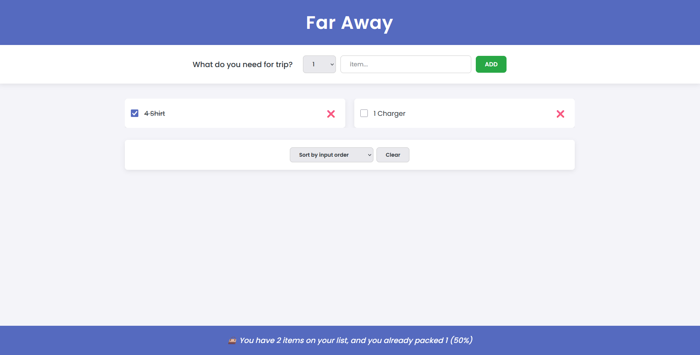

# Far Away ✈️

A simple React app to keep track of what you need for your trips.  
You can add items, mark them as packed, remove them, and see how much of your list is already completed (in percentage).

---

🚀 Features
- ➕ Add items to your travel list  
- ✅ Mark items as packed/unpacked  
- ❌ Remove items from the list  
- 📊 Shows percentage of how much you’ve packed  
- 🔄 Sort items by input order, description, or packed status  
- 🧹 Clear the entire list with one click  

---

📸 Screenshot
Here is a preview of the app:




---

## 📦 Installation & Setup

1. Clone the repository:
   ```bash
   git clone https://github.com/Elman13/Travel-List.git
2. Navigate to the project directory:
   ```bash
   cd Travel-List
   
3. Install dependencies:
   ``` bash
   npm install
   
4. Start the development server:
   ``` bash
   npm start

---

🛠 Technologies Used
-React
-JavaScript (ES6+)
-CSS

---

👨‍💻 Developed by Elman Hasannejad
